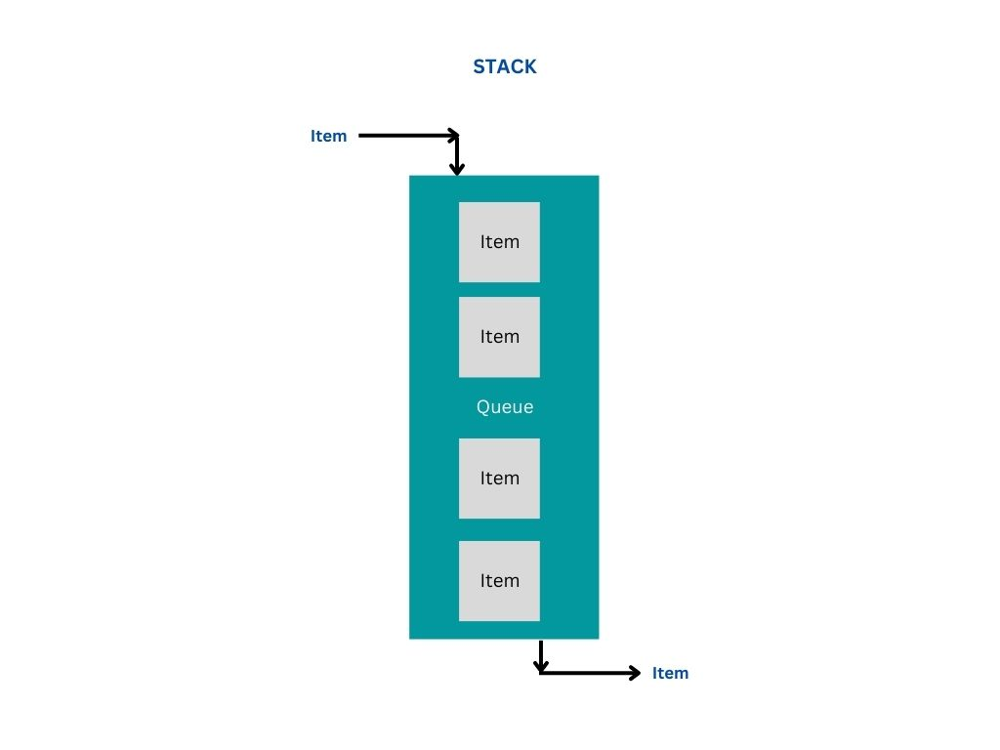

# queues.js

node package for top bottom plus lifo/ fifo queues, stack, priority queues, double ended queues, circular queues, wait queues, and semaphore queues implementation

Find the demos in the [demos folder](./demos)

# APIs queues.js

###

`Commonjs Code`

```
var queues = require("queues.js");

var Queue = require("queues.js").Queue;
var QueueFifo = require("queues.js").QueueFifo;
var QueueLifo = require("queues.js").QueueLifo;

var queue = new Queue();
var fifo = new QueueFifo();
var lifo = new QueueLifo();
```


### ESM Code

```
import { default as queues, QueueLifo, QueueFifo } as "queues.js";

var fifo = new QueueFifo();
var lifo = new QueueLifo();
```

### ESM or Commonjs Code

```
var queues = import("queues.js");
var QueueFifo = import("queues.js").QueueFifo;
var QueueLifo = import("queues.js").QueueLifo;

var fifo = new QueueFifo();
var lifo = new QueueLifo();
```

### Bases used

* Queue - Persistent Queue (stores the queue value at its place - uses a offset)
* QueueLowFootprint - Non-Persistent Queue (releases the queue value from its place permanently - use value once)
* All LowFootprint names classes / functions are non-persistent queues


### Queue (includes all Base methods)

```

const { Queue, QueueLowFootprint, QueueLifo, QueueFifo, QueueLowFootprintLifo, QueueLowFootprintFifo, AsyncQueue, AsyncQueueLowFootprint } = require("queues.js");

```


### QueueTop (includes all Base methods)

```

const { QueueTop, QueueTopLowFootprint, QueueTopLifo, QueueTopFifo, QueueTopLowFootprintLifo, QueueTopLowFootprintFifo, AsyncQueueTop, AsyncQueueTopLowFootprint } = require("queues.js");

```


### Stack (includes all Base methods)


```

const { Stack, StackLowFootprint, AsyncStack, AsyncStackLowFootprint } = require("queues.js");

```





### Double - Denqueue (includes all Base methods)

```

const { DoubleEnded, DoubleEndedLowFootprint, AsyncDoubleEnded, AsyncDoubleEndedLowFootprint } = require("queues.js");

```


### Semaphore (includes all Base methods)
In development

```

const { Semaphore } = require("queues.js");

```

### WaitQueue (includes all Base methods)
In development

```

const { WaitQueue } = require("queues.js");

```


### Priority Queue (includes all Base methods)

```

const { Priority, PriorityLowFootprint, AsyncPriority, AsyncPriorityLowFootprint } = require("queues.js");

```


### Circular Queue (includes all Base methods)
In development

```

const { Circular, AsyncCircular } = require("queues.js");

```


### FIFO BOTTOM QUEUE IMPLEMENTATION

```
//
// FIFO BOTTOM QUEUE IMPLEMENTATION
// 
//   <==   [1,2,3,4]  <==
//

var queues = require("queues.js");
var QueueFifo = require("queues.js").QueueFifo;

var fifo = new QueueFifo();
fifo.enqueue(item);
fifo.add(item);
fifo.insert(item);
fifo.push(item);

fifo.dequeue();
fifo.shift();
fifo.remove();
```

### LIFO BOTTOM QUEUE IMPLEMENTATION

```
//
// LIFO BOTTOM QUEUE IMPLEMENTATION
// 
//              <==
//   [1,2,3,4]  
//              ==>
//

var queues = require("queues.js");
var QueueLifo = require("queues.js").QueueLifo;

var lifo = new QueueLifo();
lifo.enqueue(item);
lifo.add(item);
lifo.push(item);
lifo.insert(item);

lifo.dequeue();
lifo.pop();
lifo.remove();
```

### Contributions

Contributions, Feature Improvements, Bugs, and Issues are invited. [raising an issue](https://github.com/ganeshkbhat/queues.js/issues)


# License

[MIT License](./LICENSE)
